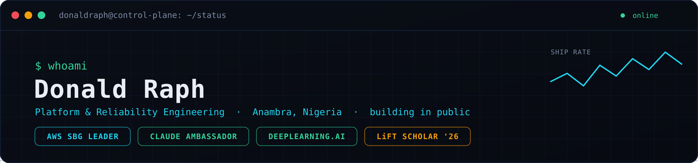

<p align="center">
  
</p>

<p align="center">
  <a href="https://github.com/donaldraph"></a>
  <a href="https://github.com/donaldraph?tab=followers"></a>
  
</p>

---

```
$ whoami
```

I build infrastructure from Anambra, in southeast Nigeria. Not Lagos, not Abuja, but here — the part of the country the tech conversation forgot. I'm building from here to represent the people it overlooked.

I run **Day Zero**, a builders' community for engineers in the southeast who have the talent but no Community infrastructure and no exposure, and I lead the first **AWS Student Builder Group** at my university. Most of what I know, I learned by leading communities and breaking things in production, then writing down what happened.

The rest of this page is the system I'm running: what's shipped, what's deploying, and what's still in the queue.

> From nothing, to everything.

---

```
$ status --all
```

| Role | State | Where |
|:--|:--|:--|
| AWS Student Builder Group Leader | `active` | UNIZIK · founding year |
| Claude Ambassador (Anthropic) | `active` | Southeast |
| DeepLearning.AI Ambassador | `active` | Southeast |
| Linux Foundation LiFT Scholar | `granted` | 2026 cohort |
| Day Zero — Founder | `running` | Southeast Nigeria |

```
FOCUS: platform engineering → SRE     UPTIME: building in public, no shortcuts
```

---

```
$ cd ~/certs && ./rollout.sh --watch
```

Nine certs, in a fixed order. The sequence is basically how a platform gets built: code → CI/CD → cloud → IaC → data → orchestration. Statuses below are live.

| Bin | Certification | Status | Target |
|:--|:--|:--|:--|
| 0001 | [GitHub Copilot](https://learn.microsoft.com/api/credentials/share/en-gb/DonaldAnyamba-7081/4733422B31DD5396?sharingId=E6284BE9ADB4BD06) | `🟢 certified` | Jun 15, 2026 |
| 0010 | GitHub Actions | `🟡 pending` | Jun 27, 2026 |
| 0011 | AWS Cloud Practitioner | `⚪ queued` | Jul 2026 |
| 0100 | AWS Solutions Architect Associate | `⚪ queued` | Aug 2026 |
| 0101 | HashiCorp Terraform Associate | `⚪ queued` | Aug 2026 |
| 0110 | MongoDB Atlas Administrator | `⚪ queued` | Sep 2026 |
| 0111 | Certified Kubernetes Administrator (CKA) | `⚪ queued` | Nov 2026 |
| 1000 | Certified Kubernetes Security Specialist (CKS) | `⚪ queued` | Feb 2027 |
| 1001 | Certified Kubernetes App Developer (CKAD) | `⚪ queued` | Apr 2027 |

```
CKA + CKS + CKAD  ──▶  Kubestronaut
```

---

```
$ systemctl list-units --type=service
```

| Service | State | What it is |
|:--|:--|:--|
| **nexus.project** | `running` | Incident-scenario trainer for SRE skills — AI-generated production failures on EKS · *EKS · LLM · React* |
| **ares.project** | `running` | AI SRE platform built for the Amazon Nova hackathon — ops dashboard over 11 microservices · *Nova · K8s* |
| **prometheus.project** | `running` | Autonomous trading bot on Polymarket's CLOB — live paper trading across 20 markets · *Python · WebSocket* |
| **dayzero.project** | `running` | Community platform — AWS-native, mobile-first for Nigerian networks · *React · AWS · CloudFront* |
| **orbit.project** | `running` | LinkedIn/Twitter monitor with Telegram alerts on EC2 · *FastAPI · Docker · EC2* |

---

```
~/unizik $ cat MISSION
```

I'm the founding Group Leader of the **AWS Student Builder Group at UNIZIK** — the first chapter at the university, part of a global program. I'm building it from zero: a real community where students ship something they can deploy, not just sit through slides.

The members platform is live at **[aws.unizikbuilders.tech](https://aws.unizikbuilders.tech)** — serverless, built on AWS, runs the whole join flow.

```
GOAL  → grow a chapter that actually builds, ending the founding year with a flagship Student Community Day.
TAG   → just show up and build.  #ShowUpAndBuild
```

*(Full playbook stays off GitHub. You get the headline, not the master plan.)*

---

```
$ queue --pending
```

Applications in flight. Targeting, not yet earned —
I'll move each to `active` when it lands.

GitHub Campus Expert      applying
Outreachy                 targeting next cohort
CNCF Ambassador           targeting next round
AWS Community Builder     targeting next intake

---

```
$ cat /proc/stack
```

<p>
  <br/>
  <br/>
  
</p>

---

```
$ contribution-graph --animate   # pods scheduling across the grid
```

<!-- WIRED UP IN CLAUDE CODE: GitHub Action writes the animated SVG to a branch, then it renders here -->
<p align="center">
  
</p>

<p align="center">
  
  
</p>

---

```
$ journalctl -u writing --follow
```

I write and record the work as I do it — debugging logs, decisions I had to make, things that broke and why. No hype.

<p>
  <a href="https://dev.to/donaldraph"></a>
  <a href="https://youtube.com/@donaldraph"></a>
  <a href="https://linkedin.com/in/donaldraph"></a>
</p>

---

```
$ uptime
Started from zero. Building in public from southeast Nigeria. Still shipping.
```
